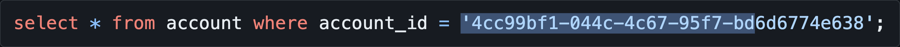

<style>


div.twocols {
  column-count: 2;
}

div.twocols p:first-child,
div.twocols h1:first-child,
div.twocols h2:first-child,
div.twocols ul:first-child,
div.twocols ul li:first-child,
div.twocols ul li p:first-child {
  /* margin-top: 0 !important; */
}

div.twocols p.break {
  break-before: column;
  margin-top: 0;
}

h1 > span, h2 > span, span.gradient {
  background: linear-gradient(157deg, rgba(30,158,0,1) 0%, rgba(240,255,0,1) 100%);
  -webkit-background-clip: text;
  -webkit-text-fill-color: transparent;
  display: inline-block;
}

.center {
  text-align: center;
}

</style>

<div class="gradient" style="font-size: 200%">

# <span>Human (o) IDs</span>
</div>

## Designing IDs for machines _and_ humans

<!-- We'll be talking about identifiers. But, before we begin, let me _identify_ myself. -->

---
<div style="font-size: 200%">

## <span>Jakub Wojnowski</span>

</div>

<!-- A little bit about me first, I'm Kuba. I spent last 7 years working in Scala, FP Scala, to be exact. Before we start, you must know I'm a bad joke connoisseur, so consider it the last warning and an opportunity to grab something to drink. -->

### _Senior Software Engineer @ SiriusXM_

* 11 years in Software Engineering
* 7 years in ~~Tibet~~ Scala
* Occasional Open Source contributor
* A connoisseur of bad movies and bad jokes


---
# <span>Let's automate parking!</span>

1) A customer drives onto a platform, steps out of a car and leaves
2) The car gets moved automagically into a free location underground
3) The customer retrieves the car by entering the licence plate number and paying the fee


---
# <span>How do we know which platform to retrieve?</span>

* `DW5T386` — licence plate number 
* `50` - level (vertical position)
* `C` - column (horizontal position)


---
# <span>How do we know which platform to retrieve?</span>

- `DW5T386` — licence plate number 
- `50C` - storage space

<!--
IDs for maintenance, manual intervention. That's the physical part.

APIs/Database IDs: the solution practically writes itself, a quick thought and we have...
-->

---
<div class="center">

# <span>`aff5172c-9330-4657-ade4-a3169e95008c`</span>
# <span>`a446364e-c05a-457b-90c0-de4287866793`</span>
# 🎉
</div>


---
<div class="center">

# <span>`aff5172c-9330-4657-ade4-a3169e95008c`</span>
# <span>`a446364e-c05a-457b-90c0-de4287866793`</span>
# Something is _no yes_ 🤔
</div>


<!--
Why on Earth would anyone do that? Don't we have a perfectly clear, human- AND machine-readable ID?

I'm not sure you're aware of it, but there's an emerging epidemic of a little-known disease called -->
---

# <span>You-you-eye-dosis</span>
> Compulsive usage of UUIDs as object identifiers, without consideration of the business, operational, or technical context of a given object.
>
> Severe cases include writing and publishing binding, company-wide documents mandating the usage of UUIDs as primary identifier for all objects, regardless of business, operational or technical context of a given object. [1]


<div style="border-top: 1px solid #aaa; margin-top: 1em; padding-top: 1em; color: #666">
[1] https://handbook.ocado.tech/#/sw-development/hallmarks?id=r1
</div>


<!--
Let me read the definition for you. It's defined as: ...

or, put plainly...
 -->

---


<!-- OK, but we can't simply go and invent diseases. We are engineers, we need some catalogue, some classification of diseases. Thankfully, there already is one. -->
---
# <span>ICD-10</span>
## International Classification of Diseases

* `J00.1` Common cold 🤧
* `I21.9` Heart attack 💔
* `F[10.129]` Cats Effect 🍻


<!--
When you encounter some Java code while browsing through Scala
When you drank a bit too much last night and you're not feeling great the next morning

But, we have a recurring disease, something that happens over and over again.
-->


---
# <span>ICD-10</span>
## International Classification of Diseases - _rematch_

- `W58.02` Struck by alligator 🐊
* `W58.02XD` Struck by alligator - subsequent encounter 🐊🐊
- `V97.33` Sucked into jet engine 👨‍🔧 ✈️
* `V97.33XD` Sucked into jet engine - subsequent encounter ✈️✈️

<!-- However, what if someone's stupid enough to annoy the alligator or play tag with a jet engine for the second time (assuming they lived through your first)? Well, dear listener, they do have special, special, refined codes for you.

And no, I'm not making that up, go look it up yourselves.

So, going back to our epidemic and following the convention, let's assign the you-you-eye-dosis a code of F21.37XD You-you-eye-dosis - subsequent encounter.
-->


---

# `F21.37XD`
# <span>You-you-eye-dosis</span>
> Compulsive usage of UUIDs as object identifiers, without consideration of the business, operational, or technical context of a given object.
>
> Severe cases include writing and publishing binding, company-wide documents mandating the usage of UUIDs as primary identifier for all objects, regardless of business, operational or technical context of a given object. [1]


<div style="border-top: 1px solid #aaa; margin-top: 1em; padding-top: 1em; color: #666">
[1] https://handbook.ocado.tech/#/sw-development/hallmarks?id=r1
</div>


<!--
But, you might be wondering:
1. Why am I telling you this?
2. What does it have to do with our warehouse example?
3. How long until we see some Scala?
4. Will there be more aligators?
-->


---

# <span>How about natural IDs?</span>
<div class="twocols">

## `50C`
## `DW5T386`
## `F21.37XD`
## `us-east-2`
<p class="break"/>

* human-friendly
* machine-friendly
* URL-friendly
* alligator-friendly? 🐊🤔

</div>

<!--
Thing is, we're already surrounded by natural IDs.
All of these are:
human-friendly
machine-friendly
URL-friendly
uh, I'm not sure if it's alligator-friendly.

We can also try the opposite question: why should we use natural IDs? 
-->


---

# <span>Why use natural IDs?</span>

Let's assume that:
1) Majority of Software Engineers are humans.
2) Majority of ~~resources~~ people supporting software are humans as well.
3) Majority of customers of the software are also humans.


<!--
Writing software for machines
Performance
Succumb to the you-you-eye-dosis
Those of you on the first line of support really doubt that last one. -->


---
<div class="center">

# <span>`3:00 a.m.` production incident simulation</span>
## `50C`
## `DW5T386`
## `F21.37XD`
## `us-east-2`

</div>


<!-- Let's get back to our examples. These have meaning. As humans, we can understand them enough to know what they represent. And believe me, if it's 3 am and you're being woken by a call because the system doesn't work and you have to work with this instead... -->
---
<div class="center">

# <span>`3:00 a.m.` production incident simulation</span>
## `ebda7e03-eb06-4653-85f4-88a0f509aba4`
## `78a03aa9-67c3-4a5a-be2e-4b380275b204`
## `c4d55307-d927-443e-91d9-5e01a439384d`
## `b9346281-486e-486b-aac2-1c37456d4385`

</div>

<!-- ... you really wish you had something human-readable. So, when can we avoid that, when can we use natural IDs? -->

---
## <span>When can we directly use natural IDs?</span>
* immutable
* machine- and URL-friendly
    * or easily, deterministically adaptable, e.g. `wroclaw_dluga` or `plwr03`
* safe for public sharing
    * non-PII (GDPR)
* relatively few records (<100k with a good system, ideally much less)


<!--
First of all, IDs must be immutable, they cannot change over time. Since we're trying to use something that's already defined, this is not guaranteed.

They need to be machine-friendly — relatively compact, easily encodable.

If they're not, maybe then can be adapted via a convention.

Then, there's the topic of security. The IDs might become visible as part of URLs, indexed by crawlers etc., so they must be a public knowledge...
... which also means we can't use personally identifiable information, not to violate the GDPR or other similar laws.

Finally, it's beside the point to have 100k natural IDs, as humans can't really wrap their minds about such a number of a different IDs, even if they are structured well. Additionally, we can start hitting some performance problems.
-->


</div>

---
<div class="center">

# <span>OK, what if we can't use natural IDs?</span>

</div>


---
<!-- They have to adhere to some requirements: -->
# <span>Random, globally unique IDs</span>
* Random generation (more-or-less)
* Independent generation
  * Offline/Local
  * Horizontally-scalable
  * Collision resistant
* Unguessable


<!-- These are some benefits in themselves, especially when we need to scale horizontally. -->
---
# <span>UUIDs?</span>

<!-- With that out of the way, let's finally face the UUIDs, and with that, let's see how many of you are still with me.

Raise your hand if you:
1. know what a UUID is,
2. work on a daily basis with UUIDs, e.g. maintaining and supporting systems,
3. someone able to recall what UUID stands for?

OK, but what it actually stands for? Well, it's 2024, so instead of asking Google, I asked...
-->
---


<!-- GPT. Number 8 will surprise you! -->

# <span>UUIDs</span>
### `30c4aeb8-047b-4898-b454-e7f1230aa3a9`

**Pros**
* All the pros of globally unique IDs
* _Very_ popular
* Native support (languages, libraries, databases)
* Can be represented with two longs (128 bits)


---
# <span>UUIDs</span>
### `30c4aeb8-047b-4898-b454-e7f1230aa3a9`
<div class="twocols">

**Pros**
- All the pros of globally unique IDs
- Native support (languages, libraries, databases)
- _Very_ popular
- Can be represented with just two longs (128 bits)
<p class="break"/>

**Cons**
* Limited alphabet (16 chars)
  * human readability
  * length vs entropy
    * 2Long
* Dashes
  * Selecting is a nightmare
  * Full-text search might be tricky (Elasticsearch, Kibana)

</div>


---
## Selecting example


---
## Selecting example


---
## Selecting example


---
## Selecting example


---
## Selecting example



---


---
## Selecting example


---
<!-- OK, so they're not perfect. But how does _perfect_ look like? -->
# <span>What would a _good_ globally unique ID be?</span>


---
# <span>Globally unique ID wishlist</span>
<!-- Here's my opinionated wishlist. Of course, marking something as the must-have or nice-to-have is up for discussion and might change depending on the circsumstances. -->
<div class="twocols">


### Must haves\*
* Reasonably unique (~UUID)
* Larger alphabet (>30 chars)
* Easily-selectable
  * no dashes
  * actually, only `A-Za-z0-9_`
  * single-case letters
* URL-friendly

<p class="break"/>

### Nice-to-haves\*
<!-- * a longer version for increased entropy -->
* no plaintext timestamp or machine ID
* no lookalikes (0 vs O, 1 vs l vs capital I)
* no obscenities

</div>

<div style="border-top: 1px solid #666;font-size: 0.5em;color:#999">
* Personal opinion, open for discussion, often depends on the context
</div>


---
# <span>Globally unique ID examples</span>
| Name | Example|
|---|---|
| UUID | `0ac3bd4d-faeb-4417-8746-d376ebc8341d` |
| UUID Readable | `Loren Chariot Addy the Titbit of Cholame questioned Cele Garth Alda and 16 windy frogs` |
| ULID | `01HX4F1C7HSRGY4WPWY6RZTN5W` |
| Nano ID | `-_UaP3i0A15SSkf5ePsog`, `Z5TeOyXXVZn3kwIqMbbjO` |
| (Truly) Random Alphanum | `Dupa1234` |
| Cuid2 | `qg625h9slhfoxwv0ip8e5jzg` |


<!-- I don't want to bore you with the comparisons, so — long story short — I personally recommend Cuid2. It ticks most of the boxes. It only swears a bit sometimes but, don't we all?
-->


---
<div class="center">

# <span>Let's assume we can't use these</span>
## `50C`
## `F21.37XD`
## `DW5T386`
## `us-east-2`

</div>


---
<div class="center">

# <span>And we don't want these</span>


## `ebda7e03-eb06-4653-85f4-88a0f509aba4`
## `78a03aa9-67c3-4a5a-be2e-4b380275b204`
## `c4d55307-d927-443e-91d9-5e01a439384d`
## `b9346281-486e-486b-aac2-1c37456d4385`

</div>


---
<div class="center">

# <span>But are these better?</span>
## `jrk7sxiq1y6ph4r6sgn1a6i4`
## `kxhqzn24pvhw5oy179inbwoc`
## `pkijda0r99u3yumon7osfu3d`
## `a7muawrcmsm84xtb8qz5kd8b`
<!-- ## `h1lohraf2bbure5rmxjpx4mn` -->

</div>

---

# <span>How can we make globally unique IDs more human-friendly?</span>


<!-- The answer is hungry. -->

---
# <span>Prefixes!</span>

## `alig_y49vmd6ceu7p3x6wyj7ht7kc`
## `cus_ko88jpiayeamxql8hwkrbj2t`
## `car_ryx12rfb9klwawajg6dhhhnc`


---
# <span>Benefits of prefixed IDs</span>
## `cus_mb3fwgn5p3dhntbpfrvosjg2`
* instantly recognisable by humans
  * harder to mix up different IDs during an investigation/f-up
* easy to validate (e.g. API level)
* quick search (e.g. in dev tools, admin panels)
<!-- * filtrable (secrets) (`sk_live_iqDf1Jb...`) -->


---
<div class="center">


# <span>Before</span>
## `jrk7sxiq1y6ph4r6sgn1a6i4`
## `kxhqzn24pvhw5oy179inbwoc`
## `pkijda0r99u3yumon7osfu3d`
## `a7muawrcmsm84xtb8qz5kd8b`
<!-- ## `h1lohraf2bbure5rmxjpx4mn` -->
</div>


---
<div class="center">


# <span>After</span>

## `loc_jrk7sxiq1y6ph4r6sgn1a6i4`
## `icd10_kxhqzn24pvhw5oy179inbwoc`
## `car_pkijda0r99u3yumon7osfu3d`
## `region_h1lohraf2bbure5rmxjpx4mn`
</div>


---

# <span>That's a lot on IDs, how about some Scala code?</span>
## (Finally!)


---
# <span>Let's write our own prefixed IDs in Scala</span>
## Requirements
1) String prefixes (3-5 letters)
2) Input validation
3) Random generation
4) Easy access to a clean ID


---
# Naïve approach
```scala
final case class PrefixedId(prefix: String, id: Cuid2)

object PrefixedId {
  def parse(rawId: String, expectedPrefix: String): Either[String, PrefixedId] =
    ...
  
  def random[F[_]](prefix: String): F[PrefixedId] =
    ...
}
```


<!--
Validation helpful
Possible to represent illegal state
-->


---
# (Still) naïve approach
```scala
final case class PrefixedId private (prefix: String, id: Cuid2)

object PrefixedId {
  def apply(prefix: String, id: Cuid2): Either[String, PrefixedId] = ...

  def parse(rawId: String, expectedPrefix: String): Either[String, PrefixedId] =
    ...

  def random[F[_]](prefix: String): F[PrefixedId] =
    ...
}
```
<!-- apply, copy etc. -->


---
# (A bit less) naïve approach
```scala
sealed abstract case class PrefixedId(prefix: String, id: Cuid2)

object PrefixedId {
  def parse(rawId: String, expectedPrefix: String): Either[String, PrefixedId] = {
    val (prefix, id) = ...
    new PrefixedId(prefix, id) {}
  }
}
```


<!-- Try it in the wild -->


---
# <span>Feeding the alligator</span> 🐊
```scala
def feed(
  alligatorId: PrefixedId,
  ratId: PrefixedId
) = ...

...
val someRatId: PrefixedId = ...
val someAlligatorId: PrefixedId = ...

feed(someRatId, someAlligatorId) // compiles
```


---
# <span>Feeding the alligator</span> 🐊
```scala
def feed(
  alligatorId: PrefixedId,
  ratId: PrefixedId
) = ...

...
val someRatId: PrefixedId = ...
val someAlligatorId: PrefixedId = ...

feed(someRatId, someAlligatorId) // compiles
```

## Easy to mix up the _dinner_ and the _diner_

(\*\*cough\*\* `W58.02XD` \*\*cough\*\*)


---

# <span>Let's write our own prefixed IDs in Scala</span>
## Requirements
1. String prefixes (3-5 letters)
2. Input validation
3. Easy access to a clean ID
4. Random generation
5) **Type safety**


---
# <span>Type-safe</span> approach
```scala
// Scala 2.x
final case class AlligatorId(value: PrefixedId) extends AnyVal

object AlligatorId {
  def parse(raw: String): Either[String, AlligatorId] =
    PrefixedId.parse(raw, "alig")
}
```

```scala
// Scala 3.x
opaque type AlligatorId = PrefixedId

object AlligatorId:
  def parse(raw: String): Either[String, AlligatorId] = 
    PrefixedId.parse(raw, "alig")
```


---
# <span>Refined types</span>
```scala
type AlligatorId = String Refined StartsWith["alig_"]
```

```scala
type AlligatorId = String Refined MatchesRegex["^alig_[a-z][a-z0-9-_]{24}$"]
```


---
# <span>Wait, is that even a valid type? 🤔
```scala
StartsWith["alig_"]
```


---
# <span>Introduction to literal types</span>
All primitives (`Byte`, `Short`, `Int`, `Long`, `Double`, `Float`, `Char`) plus `String`
```scala
val anInt: 42 = 42
val aBoolean: false = false
val aChar: 'x' = 'x'
val aDouble: 3.14 = 3.14
val aString: "foo" = "foo"

val kacEffect: F[10.129] = F.success(10.129) // 🍻
```

```scala
val just42: 42 = 42 // compiles
// val thisDoesntCompile: 42 = 41 // doesn't compile

val int: Int = just42 // widening the type
val double: Double = just42 * 3.14 // 131.88
```


---
# <span>Literal types on a quest for better IDs</span>
```scala
case class PrefixedId[P <: String](prefix: P, id: Cuid2)

PrefixedId["pfx"]("pfx", "ep88jpiayeamxql8hwkrbj2t")
```


---
# Literal types
Duplicated `"pfx"`:
```scala
PrefixedId["pfx"]("pfx", "ep88jpiayeamxql8hwkrbj2t")
```

## Solution?
Macros? 😱


---
# <span>`ValueOf[A]` to the rescue 🚑</span>
```scala
val actualValue: Int = valueOf[42] // 42
```


---
# <span>`ValueOf[A]` to the rescue 🚑</span>
```scala
case class PrefixedId[P <: String: ValueOf](id: Cuid2) {
  
  def renderWithPrefix: String = {
    val prefix: String = valueOf[P]

    s"${prefix}_${id}"
  }
}

object PrefixedId {
  def parse[P <: String](rawId: String)(implicit valueOfPrefix: ValueOf[P]) = {
    val expectedPrefix: String = valueOfPrefix.value
    ...
  }
  
}
```


---
# <span>Type-safe approach with literal types</span>
```scala
type RatId = PrefixedId["rat"]
type AlligatorId = PrefixedId["alig"]

val someRat: RatId = ...
val someAlligator: AlligatorId = someRat // compilation fails
```


---
<div style="display: flex; justify-content: flex-end">

</div>

# <span>Say hi to `jwojnowski/humanoid` 👋</span>
```scala
// type definition
type AlligatorId = PrefixedCuid2["alig"]
val AlligatorId = PrefixedCuid2Ops["alig"]

// usage
val myFavouriteAlligatorId: Either[String, AlligatorId] =
  AlligatorId.parseRequirePrefix("alig_duniua2fm1yh7lilki8xfd77")

val someRandomAlligatorId: F[AlligatorId] =
  AlligatorId.random[F]
```


---
<div style="display: flex; justify-content: flex-end">

</div>

# <span>Say hi to `jwojnowski/humanoid` 👋</span>
```scala
// type definition
type AlligatorId = PrefixedId["alig", String]
val AlligatorId = PrefixedIdOps["alig", String]

// usage
val validatedId: Either[String, AlligatorId] =
  AlligatorId.parseRequirePrefix("alig_1234")

val prefixedIdFromId: AlligatorId =
  AlligatorId.fromId("2345")
```


---
<div style="display: flex; justify-content: flex-end">

</div>

# <span>Say hi to `jwojnowski/humanoid` 👋</span>

- Out of the box support for:
  - Cuid2
  - UUID (_if you must_)
- Integrations with:
  - Circe
  - Tapir
- Adaptable to any ID, random or not


---
# <span>Take-home message</span>
<!-- To wrap things up, let's take a look at...
Come on, you didn't think I'll let you go without a bad joke at the end, did you?
-->

---
# ~~Take-home message~~
# Why do programmers prefer dark mode? 🥁


---
# ~~Take-home message~~
# Why do programmers prefer dark mode? 🥁

# Because the light attracts bugs. 🐛💡🐞 


---
# <span>The _real_ take-home message</span>
1) Consider using human-readable, natural identifiers
2) If you _really_ can't, use prefixed, human-friendly identifiers
    * Cuid2 _wink wink_
3) Use literal types for enhanced type safety

---
## Finding me 🤙


GitHub: [`jwojnowski`](https://github.com/jwojnowski)
LinkedIn: [`jakub-wojnowski`](https://www.linkedin.com/in/jakub-wojnowski/)

## Slides 📉
[jwojnowski/wsug-talk-humanoids](https://github.com/jwojnowski/wsug-talk-humanoids)

## Libraries 📚
Scuid 🦑 (Scala Cuid2): [`jwojnowski/scuid`](https://github.com/jwojnowski/scuid)
Humanoid: [`jwojnowski/humanoid`](https://github.com/jwojnowski/humanoid)

<!-- OpenID Connect: [`jwojnowski/oidc4s`](https://github.com/jwojnowski/oidc4s)
FS2 AES encryption: [`jwojnowski/fs2-aes`](https://github.com/jwojnowski/fs2-aes) -->


---
# <span>Thank you!</span>
## References
1. https://dev.to/stripe/designing-apis-for-humans-object-ids-3o5a
1. https://scala-lang.org/files/archive/spec/3.4/03-types.html#literal-types
1. https://github.com/paralleldrive/cuid2
1. https://github.com/Debdut/uuid-readable
1. https://magazyn.koleo.pl/zasada-numeracji-miejsc-w-wagonie/
1. https://www.icd10data.com/


---
# Bonus: <span>Built-in database IDs?</span>
## e.g. auto-increment/sequential/Mongo Object ID
# <span>Security says: nope.</span>

* Insecure Direct Object Reference
* Too much information (e.g. time in Mongo Object IDs)


---
# Bonus: <span>Why not use both natural IDs and UUIDs under-the-hood?</span>
1) Majority of Software Engineers are humans.
2) Majority of _resources_ supporting (failing) software are humans as well.
3) Majority of customers of the software are also humans.
4) When systems break, translation:
    1) takes time,
    1) is error-prone (on the human-human level) <!-- ask me how I know that>
    1) is error-prone (mixing the IDs up by an engineer on support),<!-- ask me how I know that -->
    1) can lead to multiple standards ([XKCD #927](https://xkcd.com/927))<!-- the most I personally encountered for a single object were 5 -->


---
# Bonus: <span>Best practices on choosing prefixes</span>

1) short (ideally, 3-5 chars)
2) distinct
3) as future-proof as possible
4) separator that doesn't break double-click-to-select


---

# Bonus: <span>Interaction time!</span>
|Natural|UUID|
|---|---|
|`50C`|`46174ce4-41c0-4ce9-b3a0-c7e910c27d21`|
|`DW5T386`|`78a03aa9-67c3-4a5a-be2e-4b380275b204`|
|`F21.37XD`|`ebda7e03-eb06-4653-85f4-88a0f509aba4`|
|`plwr03`|`c4d55307-d927-443e-91d9-5e01a439384d`|
|`us-east-2`|`b9346281-486e-486b-aac2-1c37456d4385`|


<!-- Take a good look on these -->


---
# Bonus: <span>Which one is the licence plate?</span>
|Natural|UUID|
|---|---|
|🔍|`b9346281-486e-486b-aac2-1c37456d4385`|
|🧐|`46174ce4-41c0-4ce9-b3a0-c7e910c27d21`|
|🗝️|`c4d55307-d927-443e-91d9-5e01a439384d`|
|🔮|`78a03aa9-67c3-4a5a-be2e-4b380275b204`|
|🕵️‍♀️|`ebda7e03-eb06-4653-85f4-88a0f509aba4`|
---
# <span>And the winner is...</span>
# 🔮	`78a03aa9-67c3-4a5a-be2e-4b380275b204`


---
# Bonus: Existing natural ID system to avoid


<footer>Image by KOLEO (https://magazyn.koleo.pl/zasada-numeracji-miejsc-w-wagonie/)</footer>

<!-- Jak się połączy kropki w kolejności miejsc to wychodzi pentagram -->


---
# Bonus: <span>Hungarian notation</span>
<!-- If you haven't met the Hungarian notation, it's a mostly extinct convention including type of a constant or variable within its name. -->
```scala
val bForce          = true // ya know, b is for Boolean
val iNumberOfChunks = 42 // ... and i is for Integer
```


---